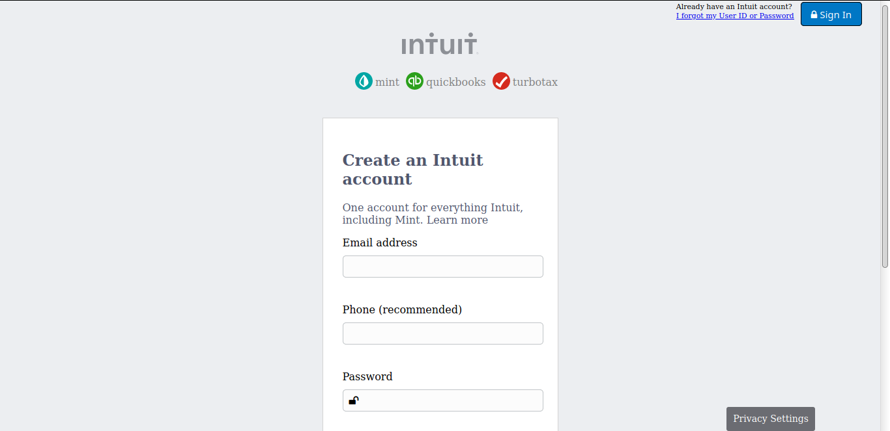

# microverse-html-forms
This project is a clone for MINT signup page a Microverse Html Forms Project

## Built With
-   HTML, CSS,
-   VSCode,

## Live Demo
[live demo](https://silly-meitner-07fbcd.netlify.app/)
## Authors

 **Daniel**

-   Github: [@githubhandle](Github: https://github.com/danielufeli )
-   Facebook: [danwebguy](facebook.com/danwebguy )

 **Youcef ABDElLANI**

-   Github: [@githubhandle](https://github.com/ABDELLANI-Youcef)
-   Twitter: [@twitterhandle](@YoucefAbdellani)
-   Linkedin: [linkedin](https://linkedin.com/youcef-abdellani-b79361124)

## Contributing
Contributions, issues and features requests are welcome!   
